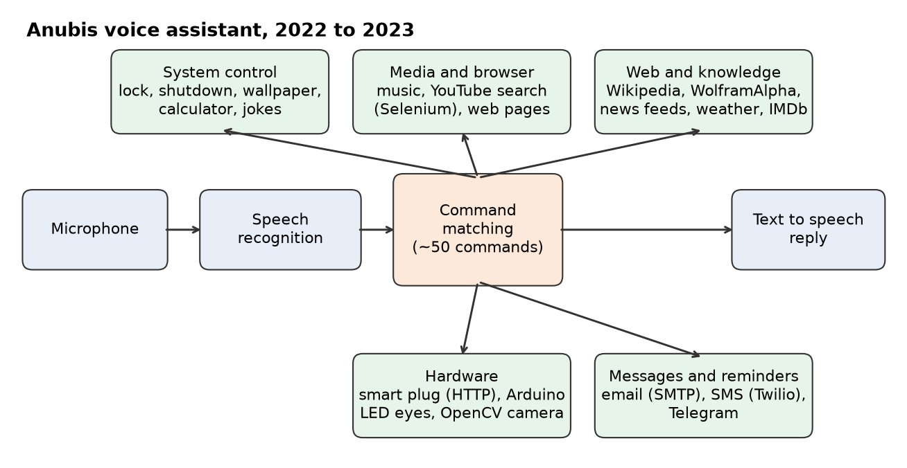

# Anubis, Voice Controlled Personal Assistant

Ioanna Texakalidou, personal software project, December 2022 to August 2023

Anubis is a desktop voice assistant I wrote in Python. You talk to it, it works out which of about 50 commands you mean, does the task and answers out loud. I built it to teach myself Python by connecting it to as many real services and devices as I could.

## What it can do

- Answer questions and do calculations through Wikipedia and WolframAlpha
- Read the news, give the weather and look up films on IMDb
- Play music, search YouTube (with Selenium) and open websites
- Send emails over SMTP and text messages through Twilio
- Lock, shut down or change the wallpaper of the computer
- Small talk, jokes, and changing its own name or yours

Alongside the main assistant I wrote separate modules that connect it to hardware:

- Turning a smart plug on and off by voice over its HTTP API
- Changing the colour of LED eyes on an Arduino over serial
- Camera experiments with OpenCV for recognising objects and estimating distance
- Scheduled reminders through a Telegram bot

## Tools

Python, SpeechRecognition, pyttsx3 and gTTS, Selenium, OpenCV, Arduino, REST APIs

The source code is private because it contains personal accounts and keys. I can show it working on a call.

Contact: j.texakalidou@gmail.com | [Portfolio](https://ioannatexakalidou.github.io)
